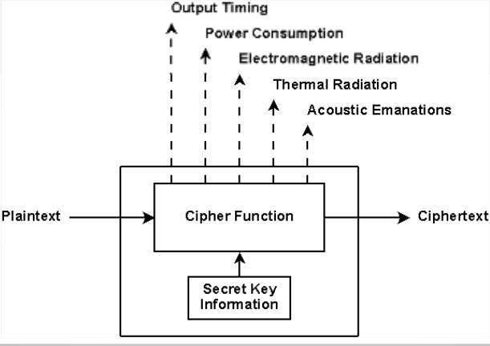
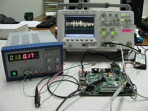

# Side-channel-attack-Power-Analysis  

School project based on Florent Bruguier work.

## Aim
This document aim to explain the side channel attack by power analysis and implement it.

## Summary
1 - [Side channel attack]  
2 - [Differential power analysis]  
3 - [AES encryption]  
3.1 - [AES weakness]  
4 - [Implementation]  
4.1 - [Mathlab program]  
4.1.1 - [Code explaination]  
4.1.2 - [Demonstration]  
4.2 - [Python implementation]  
5 - [Conclusion]  

## Side channel attack

### How it work
In modern cryptography, the deciphering process is binary. You have the good
 decryption key or not. There isn't a friendly message to tell you 'Hey you are
 on the right  way! Keep going!'.

Side channel attacks search for **physics behavior** of the cryptographic process.  
There is a lot of them (and more to discover):
- Magnetic field analysis
- Sound leaks
- Timing attack
- Row hammer
- Differential power analysis

The last one is the one explained in this document.

### Why does those attack exist ?

Computer security is multiple level domain. Predict and model those attack is very difficult.   
Each layers of the security domain work on the others layers security assumption. The software developer assume that the hardware designer did his job well.  
As a result, security faults involve unanticipated interactions between components. Components who are made by different people.  
  
With the existing model, side channel attacks can't be avoided. The model is vulnerable by design.

## Differential power analysis

On the hardware level, cryptographic algorithm are implemented using semiconductor and logic gates (made of transistors). Those component have a power consumption, who can be measured.
First of all, this attack can't be easily implemented at home.

You need an oscilloscope and a physical access to the processor/chip tested.    

  


In addition of the SPA (simple power analysis) we add statistical function to guess sensitive information from power consumption.

## AES Encryption
As wikipedia say:   
```
'AES (acronym of Advanced Encryption Standard) is a symmetric encryption algorithm. The algorithm was developed by two Belgian cryptographer Joan Daemen and Vincent Rijmen. AES was designed to be efficient in both hardware and software, and supports a block length of 128 bits and key lengths of 128, 192, and 256 bits.'
```  

AES is a standard and widely used. Facts that make him very interesting for hackers.  
In each of the 16 rounds

TODO Un draw.io  expliauqtif du fonctionnement de l'attaque
trouver comment lire les data
https://www.cis.upenn.edu/~nadiah/courses/cis800-02-f13/readings/kocher-jaffe-jun.pdf
