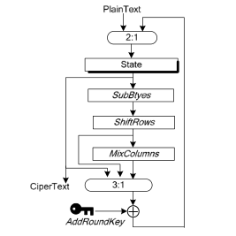

# Side-channel-attack-Power-Analysis  

School project based on Florent Bruguier work.

## Aim
This document aims to explain side a channel attack using differential power analysis and implements it.

## Summary
1 - [Side channel attack](#side-channel-attack)  
2 - [Differential power analysis](#differential-power-analysis)  
3 - [AES encryption](#aes-encryption)  
3.1 - [AES weakness](#aes-weakness)  
4 - [Implementation](#implementation)  
4.1 - [Matlab program](#matlab-program)  
5 - [Conclusion](#conclusion)    

## Side channel attack

### How it work
In modern cryptography, the deciphering process is binary. You have the good
 decryption key or not. There isn't a friendly message to tell you, 'Hey you are
 on the right  way! Keep going!'.

Side channel attacks search for **physics behaviours** of the cryptographic process.  
There is a lot of them (and more to discover):
- Magnetic field analysis
- Sound leaks
- Timing attack
- Row hammer
- Differential power analysis

The last one is the one explained in this document.

### Why do those attacks exist ?

Computer security is multiple level domains. Predict and model those attacks is very difficult.   
Each layer of the security domain works on the other layers security assumption. The software developer assume that the hardware designer did his job well.  
As a result, security faults involve unanticipated interactions between components. Components who are made by different people.  
  
With the existing model, side channel attacks can't be avoided. The model is vulnerable by design.

## Differential Power Analysis

On the hardware level, cryptographic algorithms are implemented using semiconductor and logic gates (made of transistors). Those components have a power consumption, which can be measured.
First of all, this attack can't be easily implemented at home.

You need an oscilloscope and a physical access to the processor/chip tested.    

  


In addition of the SPA (simple power analysis) we add statistical function to guess sensitive information from power consumption.

## AES Encryption
As Wikipedia say:   
```
'AES (acronym of Advanced Encryption Standard) is a symmetric encryption algorithm. The algorithm was developed by two Belgian cryptographer Joan Daemen and Vincent Rijmen. AES was designed to be efficient in both hardware and software, and supports a block length of 128 bits and key lengths of 128, 192, and 256 bits.'
```  

AES is a standard and widely used. Facts that make him very interesting for hackers.  

# AES Weakness

In AES, the plain text block is first XORed with the primary key and then goes through 10 rounds of processing. Each round consist of :
- SubByte
- ShiftRow
- MixColumn
- AddRoundKey  

  
We are looking for the roundkey of the last round (the only without the MixColumn step).  


In order to implement a DPA attack, an attacker first observes m encryption operations and T power traces captures with k samples each.


# Implementation
To be successful a DPA attack needs to follow a few steps:    
- Generate a huge amount of encryption/decryption operation with the target cryptosystem and key.  
- For each operation get the power consumption and the I/O (clear text and/or cipher text)  
- Take a byte from the SBOX output and use it as a separator.  
- Make the average of each sub group  
- Do the operation for each possible value of a byte (255).  
- Take the highest value and enjoy finding a Bite of the key.   
- Repeat for each byte if the key.  
 
## Matlab program 

The first exercise was to plot the power traces and then 'zoom' on the first round :
```Matlab
% --> create the plots here <-- 
figure(1);
plot(traces(1,:));
title('Consommation totale d’un chiffrement');

% --> With zoom on first round <-- 
offset = 50000;
segmentLength = 40000;
traces2 = myload('traces-00112233445566778899aabbccddeeff.bin', traceSize, offset, segmentLength, numberOfTraces);

% --> Zoom into an AES round <--
figure(2);
plot(traces2(2,:));
title('Consommation d’un round AES');
```
That's all for the first part.

Exercise 2 consists of the key recovery itself:
- First the variables declaration
```Matlab
% variables declaration
byteStart = 1; 
byteEnd = 16; % AES-128  
keyCandidateStart = 0;
keyCandidateStop = 255; % All possibilities on 1 Bytes
solvedKey = zeros(1,byteEnd);
```
- We need to loop over the 200 traces gived, and split them into 2 groups :
```Matlab
 % On parcours l'ensemble des 200 traces
        for L = 1:numberOfTraces
            %Récupération du premier bit du résultat
            %des deux premières étapes de l’AES
            firstByte = bitget(Hypothesis(L,K+1),1);
            if firstByte == 1
                %Incrémention des traces dans les groupes
                group1(1,:) = group1(1,:) + traces2(L,:);
                nbTracesG1 = nbTracesG1 + 1;
            else
                group2(1,:) = group2(1,:) + traces2(L,:);
                nbTracesG2 = nbTracesG2 + 1;
            end;
        end;
```

- Then we loop over each key candidate and make the average of each subgroup :
```Matlab
   for K = keyCandidateStart:keyCandidateStop                            
        % --> calculate hypothesis here <--
        % Two AES first steps
        Hypothesis(:,K+1)=bitxor(plain text(:,BYTE),K);
        Hypothesis(:,K+1)=SBOX(Hypothesis(:,K+1)+1);
        
        group1 = zeros(1,segmentLength);
        group2 = zeros(1,segmentLength);
        
        % --> do the differential analysis here <--
        % Séparation des traces en fonction d'une sous-clée
        nbTracesG1 = 0;
        nbTracesG2 = 0;
        % Previous snippet here 
         %Calcul de la moyenne des groupes
        group1(1,:) = group1(1,:) / nbTracesG1;
        group2(1,:) = group2(1,:) / nbTracesG2;
        
        %Création du groupe final composé de la soustraction
        %en valeur absolue des deux groupes précédents
        groupFin(K+1,:) = abs(group1(1,:)-group2(1,:));
    end;
 ```
- Last part : get the highest point of each raw and clumn to find the correct value.
```Matlab
% for every byte in the key do:
for BYTE=byteStart:byteEnd
     % Create the hypothesis matrix (dimensions: 
    % rows = numberOfTraces, columns = 256). 
    % The number 256 represents all possible bytes (e.g., 0x00..0xFF)
    groupFin(1,:) = zeros(1,segmentLength);
    Hypothesis = zeros(numberOfTraces,256);
    cmptPlainText=0;    
   
    % Previous snippet here
    
    %Récupération de la ligne qui comporte le point le plus haut
    %de la courbe de puissance
    %1°) -- On recherche tous les max de toutes les lignes
    %2°) -- On récupère l’index de ligne et de colonne des MAX
    [ligne,colonne]=ind2sub(size(groupFin), find(groupFin==max(groupFin(:))));
    
    solvedKey(1,BYTE) = ligne - 1;
    
    %Affichage temporaire de la courbe pour vérification
    %figure(3);
    %plot(groupFin(1,:));
    %title('Courbe DPA !');
 end;
```

Now the full code in one :
```Matlab
%%%%%%%%%%%%%%%%%%%%%%%%%%%%%%%%%%%%%%%%%
% Matlab key recovery exercise template %
%                                       %
% 2014, Florent Bruguier, PCM - CNFM    %
%%%%%%%%%%%%%%%%%%%%%%%%%%%%%%%%%%%%%%%%%

% declaration of the SBOX (might be useful to calculate the power hypothesis)
SBOX=[099 124 119 123 242 107 111 197 048 001 103 043 254 215 171 118 ...
      202 130 201 125 250 089 071 240 173 212 162 175 156 164 114 192 ...
      183 253 147 038 054 063 247 204 052 165 229 241 113 216 049 021 ...
      004 199 035 195 024 150 005 154 007 018 128 226 235 039 178 117 ...
      009 131 044 026 027 110 090 160 082 059 214 179 041 227 047 132 ...
      083 209 000 237 032 252 177 091 106 203 190 057 074 076 088 207 ...
      208 239 170 251 067 077 051 133 069 249 002 127 080 060 159 168 ...
      081 163 064 143 146 157 056 245 188 182 218 033 016 255 243 210 ...
      205 012 019 236 095 151 068 023 196 167 126 061 100 093 025 115 ...
      096 129 079 220 034 042 144 136 070 238 184 020 222 094 011 219 ...
      224 050 058 010 073 006 036 092 194 211 172 098 145 149 228 121 ...
      231 200 055 109 141 213 078 169 108 086 244 234 101 122 174 008 ...
      186 120 037 046 028 166 180 198 232 221 116 031 075 189 139 138 ...
      112 062 181 102 072 003 246 014 097 053 087 185 134 193 029 158 ...
      225 248 152 017 105 217 142 148 155 030 135 233 206 085 040 223 ...
      140 161 137 013 191 230 066 104 065 153 045 015 176 084 187 022];


%%%%%%%%%%%%%%%%%%%%
% LOADING the DATA %
%%%%%%%%%%%%%%%%%%%%

% modify following variables so they correspond 
% your measurement setup
numberOfTraces = 200;
traceSize = 370000;

% modify the following variables to speed-up the measurement
% (this can be done later after analysing the power trace)
offset = 0;
segmentLength = 370000; % for the beginning the segmentLength = traceSize
                    
% columns and rows variables are used as inputs 
% to the function loading the plain text/cipher text
columns = 16;
rows = numberOfTraces;

%%%%%%%%%%%%%%%%%%%%%%%%%
% Calling the functions %
%%%%%%%%%%%%%%%%%%%%%%%%%

% Function myload processes the binary file containing the measured traces and
% stores the data in the output matrix so the traces (or their reduced parts)
% can be used for the key recovery process.
% Inputs:
%   'file' - name of the file containing the measured traces
%   traceSize - number of samples in each trace
%   offset - used to define different beginning of the power trace
%   segmentLength - used to define different/reduced length of the power trace
%   numberOfTraces - number of traces to be loaded
%
% To reduce the size of the trace (e.g., to speed-up the computation process) 
% modify the offset and segmentLength inputs so the loaded parts of the
% traces correspond to the trace segment you are using for the recovery.
traces = myload('traces-00112233445566778899aabbccddeeff.bin', traceSize, offset, segmentLength, numberOfTraces);

% function myin is used to load the plain text and cipher text 
% to the corresponding matrices. 
% Inputs:
%   'file' - name of the file containing the plain text or cipher text
%   columns - number of columns (e.g., size of the AES data block)
%   rows - number of rows (e.g., number of measurements)
plaintext = myin('plaintext-00112233445566778899aabbccddeeff.txt', columns, rows);
ciphertext = myin('ciphertext-00112233445566778899aabbccddeeff.txt', columns, rows);

%%%%%%%%%%%%%%%%%%%%%%%%%%%%%%%%%%%%%%%%%%%%%%
% EXERCISE 1 -- Plotting the power trace(s): %
%%%%%%%%%%%%%%%%%%%%%%%%%%%%%%%%%%%%%%%%%%%%%%
% Plot one trace (or plot the mean value of traces) and check that it is complete 
% and then select the appropriate part of the traces (e.g., containing the first round).

% --> create the plots here <-- 
%figure(1);
%plot(traces(1,:));
%title('Consommation totale d’un chiffrement');

% --> With zoom on first round <-- 
offset = 50000;
segmentLength = 40000;
traces2 = myload('traces-00112233445566778899aabbccddeeff.bin', traceSize, offset, segmentLength, numberOfTraces);
%figure(2);
%plot(traces2(2,:));
%title('Consommation d’un round AES');


%%%%%%%%%%%%%%%%%%%%%%%%%%%%%%%
% EXERCISE 2 -- Key recovery: %
%%%%%%%%%%%%%%%%%%%%%%%%%%%%%%%
% Create the power hypothesis for each byte of the key and then correlate
% the hypothesis with the power traces to extract the key.
% Task consists of the following parts:
%   - calculate the intermediate values
%   - create the power hypothesis
%   - extract the key

% variable declaration
byteStart = 1;
byteEnd = 16;
keyCandidateStart = 0;
keyCandidateStop = 255;
solvedKey = zeros(1,byteEnd);

% for every byte in the key do:
for BYTE=byteStart:byteEnd
 
    
    % Create the hypothesis matrix (dimensions: 
    % rows = numberOfTraces, columns = 256). 
    % The number 256 represents all possible bytes (e.g., 0x00..0xFF)
    groupFin(1,:) = zeros(1,segmentLength);
    Hypothesis = zeros(numberOfTraces,256);
    cmptPlainText=0;
    
    for K = keyCandidateStart:keyCandidateStop                            
        % --> calculate hypothesis here <--
        % Two AES first steps
        Hypothesis(:,K+1)=bitxor(plain text(:,BYTE),K);
        Hypothesis(:,K+1)=SBOX(Hypothesis(:,K+1)+1);
        
        group1 = zeros(1,segmentLength);
        group2 = zeros(1,segmentLength);
        
        % --> do the differential analysis here <--
        % Séparation des traces en fonction d'une sous-clée
        nbTracesG1 = 0;
        nbTracesG2 = 0;
        
        % On parcourt l’ensemble des 200 traces
        for L = 1:numberOfTraces
            %Récupération du premier bit du résultat
            %des deux premières étapes de l’AES
            firstByte = bitget(Hypothesis(L,K+1),1);
            if firstByte == 1
                %Incrémention des traces dans les groupes
                group1(1,:) = group1(1,:) + traces2(L,:);
                nbTracesG1 = nbTracesG1 + 1;
            else
                group2(1,:) = group2(1,:) + traces2(L,:);
                nbTracesG2 = nbTracesG2 + 1;
            end;
        end;
       h
    
    %Récupération de la ligne qui comporte le point le plus haut
    %de la courbe de puissance
    %1°) -- On recherche tous les max de toutes les lignes
    %2°) -- On récupère l’index de ligne et de colonne des MAX
    [ligne,colonne]=ind2sub(size(groupFin), find(groupFin==max(groupFin(:))));
    
    solvedKey(1,BYTE) = ligne - 1;
    
    %Affichage temporaire de la courbe pour vérification
    %figure(3);
    %plot(groupFin(1,:));
    %title('Courbe DPA !');
    
    % --> do some operations here to find the correct byte of the key <--

end;
```

# Conclusion
Through this exercise, we were able to implement a successful DPA attack on AES-128. Even if the attack has a lot of requirements and needs a lot of work to be effective, we clearly see the possibilities and the threats of sides channel attacks.    

In the actual state of art, nothing cheap and effective can be found to avoid those attacks. The consumption randomisation and reduction is clearly too expensive for entities others than governments or big companies.     

The progressive centralisation of computing process in the 'cloud' may help governements and agencies to perform side channels attack. Indeed, a datacenter is a warehouse with physical access to a lot of computing hardware. And the standardisation of side channel attacks on datacenter may already be a reality.   

Who know what's going on behind those big walls.  
